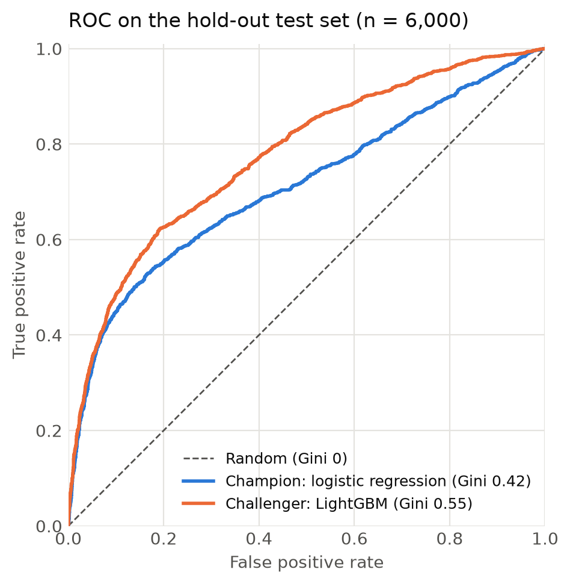

# ML PD Model

[](https://github.com/BenFlint123/ML_PD_Model/actions/workflows/ci.yml)

[](https://docs.astral.sh/uv/)
[](https://docs.astral.sh/ruff/)
[](LICENSE)

A sandbox for applying machine learning to **credit risk**, starting with
**probability of default (PD)** models for retail credit cards.

Models are built as **champion / challenger** pairs. An interpretable
logistic regression, the standard in regulated credit risk, is benchmarked
against more flexible ML models. The aim is to measure how much predictive
power each approach adds, and what it costs in explainability.

> **Status: work in progress.** A logistic regression champion and a
> LightGBM challenger are trained and evaluated. See the [roadmap](#roadmap)
> for what comes next.

---

## Motivation

This project applies techniques from the
[MIT MicroMasters in Statistics and Data Science](https://micromasters.mit.edu/ds/)
to the credit risk domain. The goal is a set of worked examples, and
reusable tooling, for exploring ML approaches to credit risk problems.

Two datasets are used, on purpose:

1. **Taiwan credit card defaults:** clean and well documented. Used to build
   proofs of concept quickly.
2. **Lending Club loans:** much larger and messier. Used to test and iterate
   on the approaches that work on the Taiwan data.

---

## Results so far



| Model | Role | Train Gini | Test Gini | Test AUC |
|---|---|---:|---:|---:|
| Logistic regression | Champion | 0.459 | **0.420** | 0.710 |
| LightGBM (default params) | Challenger | 0.769 | **0.551** | 0.776 |

Evaluated on a stratified 20% test set of 6,000 accounts.
Gini = 2 × AUC − 1, the standard measure of discrimination in credit risk.

**Takeaways**

- The untuned challenger improves on the champion by about 13 Gini points.
  This suggests there is non-linear signal the linear model misses.
- Both models separate the highest-risk accounts about equally well (the
  bottom left of the ROC curve). The challenger's advantage comes in the
  middle of the score range.
- The challenger's train Gini (0.77) is much higher than its test Gini
  (0.55), which shows it overfits with default settings. Tuning comes
  before any conclusion is drawn about the champion.

To regenerate the figure and table, run
`uv run python scripts/make_readme_figure.py`.

---

## Datasets

### Taiwan credit card defaults (current)

[Default of Credit Card Clients](https://archive.ics.uci.edu/dataset/350/default+of+credit+card+clients),
from the UCI Machine Learning Repository (Yeh & Lien, 2009).

- 30,000 credit card holders from a Taiwanese bank, as of October 2005
- Target: default on next month's payment (base rate 22.1%)
- 23 features: credit limit, demographics, and six months each of
  repayment status, bill amounts and payment amounts

**Key data decisions** (documented in full in
[`00_EDA_Taiwan_dataset`](notebooks/00_EDA_Taiwan_dataset.ipynb)):

- **Undocumented category codes:** `EDUCATION` values 0, 5 and 6 are mapped
  to "other" (4), and `MARRIAGE` value 0 is mapped to "other" (3).
- **Repayment status (`PAY_*`):** the data dictionary defines only −1 and
  1 to 9, but −2 and 0 appear in large volumes. For now they are treated
  as ordinal-numeric, using the common reading of −2 as "no consumption"
  and 0 as "revolving credit". This is a known limitation: it assumes an
  ordering for codes whose meaning is unverified.

### Lending Club (exploration)

[Lending Club accepted loans, 2007 to 2018](https://zenodo.org/records/11295916).
Initial exploration only, in [`01_EDA_LCData`](notebooks/01_EDA_LCData.ipynb).

Neither dataset is committed to the repo. To reproduce, download the raw
files into `data/raw/`.

---

## Approach

| Notebook | Purpose |
|---|---|
| [`00_EDA_Taiwan_dataset`](notebooks/00_EDA_Taiwan_dataset.ipynb) | Profiling, variable typing, cleaning of undocumented codes |
| [`01_EDA_LCData`](notebooks/01_EDA_LCData.ipynb) | First look at the Lending Club data |
| [`02_Data_preparation_Taiwan_Dataset`](notebooks/02_Data_preparation_Taiwan_Dataset.ipynb) | Stratified 80/20 train/test split |
| [`03_champion_logistic`](notebooks/03_champion_logistic.ipynb) | Logistic regression in an sklearn `Pipeline` (scaling + one-hot encoding) |
| [`04_challenger_LightGBM`](notebooks/04_challenger_LightGBM.ipynb) | LightGBM challenger, built with the shared `ModelBuilder` interface |

Reusable modelling code lives in [`lib/`](lib/), not in the notebooks.
[`lib/model_development.py`](lib/model_development.py) defines an abstract
`ModelBuilder` base class. It fixes a common interface (`train`,
`predict_*`, `run`) and supports an optional out-of-time hold-out sample.
New challengers plug into the same comparison without the evaluation code
changing.

Shared constants, including paths, the random seed, the target variable
and feature lists, are kept in a single [`config.py`](config.py), so the
notebooks don't hard-code them.

---

## Getting started

Requires [uv](https://docs.astral.sh/uv/getting-started/installation/).
uv installs the correct Python version for you.

```bash
git clone https://github.com/BenFlint123/ML_PD_Model.git
cd ML_PD_Model
uv sync --all-groups                 # create the venv, install deps + lib (editable)
uv run pre-commit install            # optional: enable the git hooks
uv run pytest                        # check everything works
```

Put the raw dataset in `data/raw/`, then run the notebooks in numerical
order:

```bash
uv run jupyter lab
```

### Project structure

```
├── config.py                  # paths, seeds, feature lists, category mappings
├── data/                      # gitignored: raw → interim → processed
├── docs/images/               # figures used in this README
├── lib/
│   └── model_development.py   # ModelBuilder ABC + LightGBM implementation
├── notebooks/                 # numbered analysis pipeline (00 → 04)
├── scripts/                   # reproducible figure generation
└── tests/                     # pytest suite for lib/
```

---

## Engineering practices

- **Tested:** `lib/` has a pytest suite that runs on synthetic data, so it
  needs no data download. It covers the builders' interfaces, error
  handling, reproducibility and the two construction paths.
- **Reproducible environment:** dependencies are locked in `uv.lock`, and
  `pyproject.toml` is the single source of truth. A fixed seed is used for
  every split and model fit.
- **CI on every PR:** GitHub Actions runs a Ruff format check, lint and
  pytest. Actions are SHA-pinned and kept up to date by Dependabot.
- **Pre-commit hooks:** Ruff and `nbstripout` run on commit, so notebooks
  are committed without outputs and diffs stay readable. Tests run on push.
- **No data in git:** the `data/` directory is gitignored end to end.

---

## Roadmap

This is the near-term plan. It will be extended as the project develops.

- [x] Logistic regression champion
- [x] LightGBM challenger, built on a shared `ModelBuilder` interface
- [x] Unit tests for the model builders
- [ ] Linear and logistic regression baselines built on `ModelBuilder`
- [ ] Random forest challenger
- [ ] Hyperparameter tuning (cross-validated) for the challengers
- [ ] Basic feature selection
- [ ] Carry the pipeline over to the Lending Club data

---

## License

BSD 3-Clause, see [LICENSE](LICENSE).

The Taiwan dataset is provided by the UCI Machine Learning Repository under
[CC BY 4.0](https://creativecommons.org/licenses/by/4.0/). Yeh, I-C. (2009).
*Default of Credit Card Clients* [Dataset].
https://doi.org/10.24432/C55S3H
